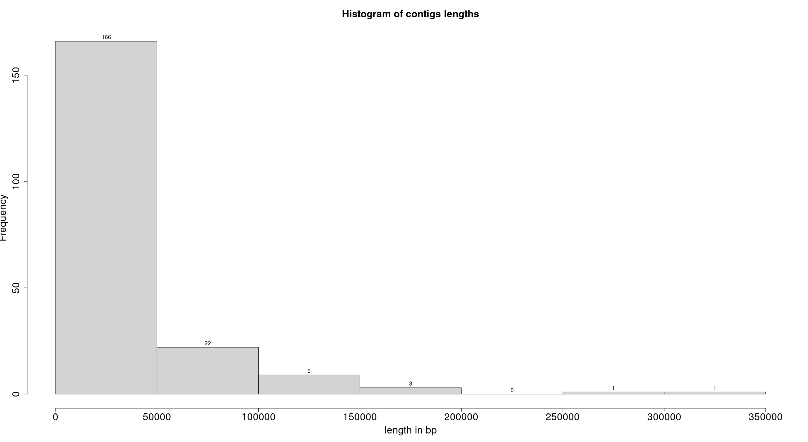
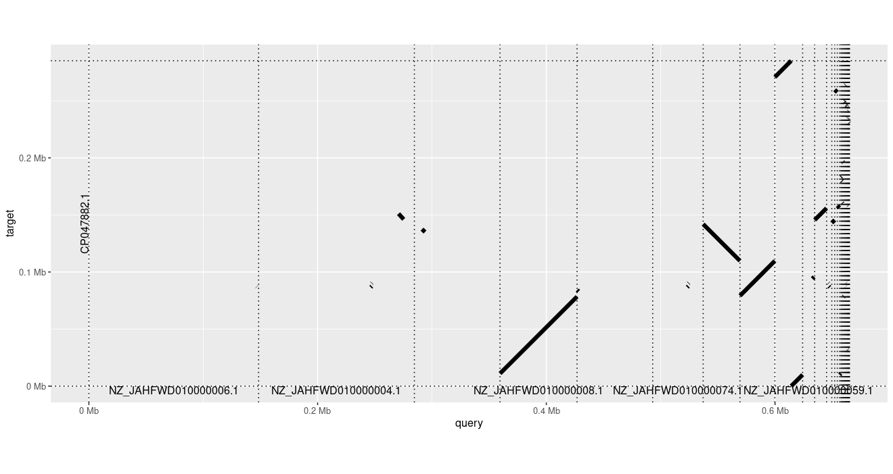

[](https://hariszaf.github.io/Salmonella-infantis-GEM)

# Salmonella-infantis-GEM

## Overall notes regarding `memote` and  CI-CD 

- The `build` will fail if the model stays the exact same. Thus, `merge` if and only if the `.sbml` file has changes. 


## Dependencies 

For the annotation: 
- `RASTtk`


For visualization: 
- `pafr` R libray

For alignment: 
- `minimap2`

For GEM reconstruction:

- `memote` 
- `modelseedpy` 
- `cobrapy`

KBase can be used to skip parts of CLI. 


## Regarding the assembly to be used 

We are using the publically available genome of the MRS-16/01939 strain of *S. infantis** [GCF_019918175.1](`https://www.ncbi.nlm.nih.gov/assembly/GCF_019918175.1/`).
Our strain carries a pESI-like plasmid. The sequence of the plasmid is also publically available ([CP047882](https://www.ncbi.nlm.nih.gov/nuccore/CP047882.1)).
The same strain can be also found without the plasmid; its genome is also available ([GCF_019918165.1](https://www.ncbi.nlm.nih.gov/assembly/GCF_019918165.1/))

Let's have a look at the lengths of the contigs present:



with NZ_JAHFWD010000014.1 being the longest contig. 


Using `minimap2` we first mapped the plasmid sequence (query; 1 sequence) against the contigs of the assembly (query; 202 contigs), as ideally the plasmid sequence should be part of one or two contigs: 

```bash
minimap2 CP047882.1_plasmid_s_i.fasta GCF_019918175.1_ASM1991817v1_genomic.fna > alignment.paf
```

By running the following chunk of code in R we get the figure below.

```R
library(pafr)
ali <- read_paf("alignment.paf")
# Drop low-quality, short or otherwise non-ideal alignments
prim_alignment <- filter_secondary_alignments(ali)

# order_by : 
# - 'Size': lines up query and target sequences from largest to smallest. 
# - 'qstart': keeps the query sequences ordered by size, but rearranges the targets by where they match to query sequences
# -  'provided', you need to provide a list to the function with two elements: the order of the query, and then target, sequences.

dotplot(prim_alignment, label_seqs=TRUE)
```

Apparently, only about the half of the plasmid seems to be present in our strain.


If we go the other way around and we map the contigs against the plasmid, we can extract the sequences from the contigs, mapping to plasmid sequences. 



Contigs on my assembly including plasmid parts as they appear on the plasmid sequence:

|  contig id         | length | start | end | 
|:------------------:|:------:|:-----|:----:|
| NZ_JAHFWD010000047.1* | 9,988  | 1 | 9,988 | 
| NZ_JAHFWD010000146.1  | 1,102  | 9,969 | 11,062 | 
| NZ_JAHFWD010000008.1  | 67,372 | 11,054 | 78,415| 
| NZ_JAHFWD010000033.1  |   544  | 78,189 |  78,721 |
| NZ_JAHFWD010000034.1  | 30,482 | 79,193 | 109,751 |
| NZ_JAHFWD010000013.1  | 32,217 | 109,738 | 141,946 |
| NZ_JAHFWD010000078.1  |  2,566 | 143,014 | 145,573 |
| NZ_JAHFWD010000097.1  | 10,374 | 145,563 |  155,930 |
| NZ_JAHFWD010000093.1  |  2,041 | 156,236 | 158,183 |
| NZ_JAHFWD010000168.1  |   283  | 158,168 | 158,440 |
| NZ_JAHFWD010000145.1  |   559  | 160,032 | 160,576 |
| NZ_JAHFWD010000166.1  |   584  | 179,196 | 179,762 |
| NZ_JAHFWD010000128.1  |   587  | 183,100 | 183,670 |
| NZ_JAHFWD010000154.1  |   553  | 196,005 | 196,543 |
| NZ_JAHFWD010000077.1  |  246   | 230,216 | 230,449 |
| NZ_JAHFWD010000073.1  |   264  | 230,460 | 230,711 |
| NZ_JAHFWD010000156.1  |    232 | 234,020 | 234,246 | 
| NZ_JAHFWD010000164.1  |   284  | 234,383 | 234,653 |
| NZ_JAHFWD010000179.1  |   269  | 240,692 | 240,954 |
| NZ_JAHFWD010000171.1  |   393  | 244,441 | 244,794 |
| NZ_JAHFWD010000163.1  |   396  | 245,521 | 245,914 |
| NZ_JAHFWD010000186.1  |   318  | 246,226 | 246,529 |
| NZ_JAHFWD010000172.1  |   540  | 248,300 | 248,819 |
| NZ_JAHFWD010000135.1  |   426  | 249,506 | 249,922 |
| NZ_JAHFWD010000120.1  |  2,232 | 257,464 | 259,683 |
| NZ_JAHFWD010000174.1  |   415  | 263,641 | 263,990 |
| NZ_JAHFWD010000047.1* | 14,305 | 270,727 | 285,075 | 


\* half of the contig matches in the start and the other half in the end of the plasmid |


Using the [Bakta](https://bakta.computational.bio) platform, we annotated the plasmid sequence (see [`s_infantis_plasmid_annotation.xlsx`](docs/s_infantis_plasmid_annotation.xlsx))
Comparing the coordinates we get which genes are present in the plasmid of our strain.


## GEM reconstuction steps 

1. RAST-annotate your assembly. One can go for that in the following ways: 
   - GUI approach: through [KBase](https://www.kbase.us) and more specifically by running the [`
Annotate Microbial Assembly with RASTtk - v1.073`](https://narrative.kbase.us/#appcatalog/app/RAST_SDK/annotate_contigset/release) tool.
   - CLI approach: using RASTtk which now is part of the Bacterial and Viral Bioinformatics Resource Center ([BV-BRC](https://www.bv-brc.org/docs/overview.html)) - [tutorial](https://www.bv-brc.org/docs/cli_tutorial/rasttk_getting_started.html). Also, [here](https://github.com/TheSEED/RASTtk-Distribution/releases/).

In our case, we used the second approach and we ran the [`rast_annotate.sh`](scripts/) script.

2. Use `ModelSeedPy` to get a draft reconstruction. **Attention:** no medium, no gapfilling is used at this step. The classic biomass is used! 


---------

## Usage

All `memote` commands have extensive help descriptions.

1. For simple command line testing, check out `memote run -h`.
2. To generate a pretty report, check out `memote report snapshot -h`.

## Testing the Model with Continuous Integration

Currently, we can enable continuous model testing using Travis CI. All you have
to do is:

1. Create a [GitHub](https://github.com/) account.
2. Create an account at https://travis-ci.org using your GitHub account.
3. Run `memote online`.
4. A history report will be publicly visible at https://hariszaf.github.io/Salmonella-infantis-GEM.


---

<a rel="license" href="http://creativecommons.org/licenses/by/4.0/"></a><br />This work is licensed under a <a rel="license" href="http://creativecommons.org/licenses/by/4.0/">Creative Commons Attribution 4.0 International License</a>.
