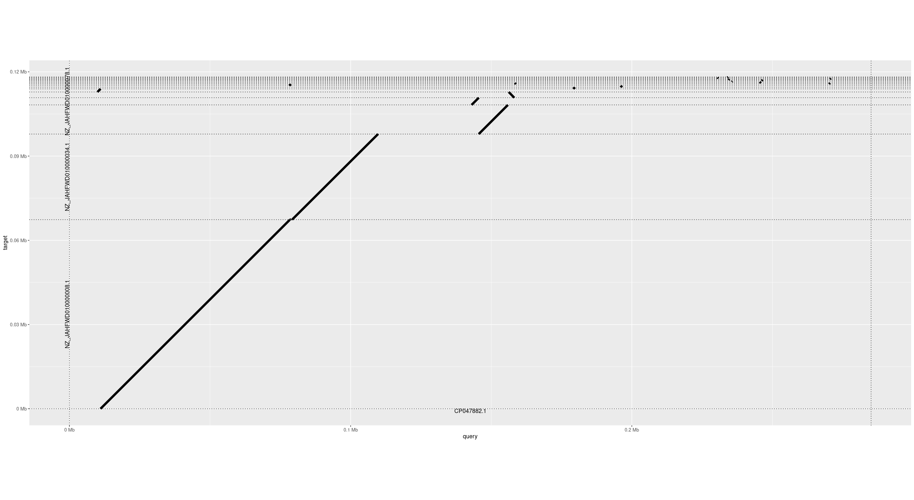

[](https://hariszaf.github.io/Salmonella-infantis-GEM)

# Salmonella-infantis-GEM

## Overall notes regarding `memote` and  CI-CD 

- The `build` will fail if the model stays the exact same. Thus, `merge` if and only if the `.sbml` file has changes. 


## Dependencies 

- `memote` 
- `modelseedpy` 
- `cobrapy`
- `RASTtk`
- `minimap2`

KBase can be used to skip parts of CLI. 


## Regarding the assembly to be used 

We are using the publically available genome of the MRS-16/01939 strain of *S. infantis** [GCF_019918175.1](`https://www.ncbi.nlm.nih.gov/assembly/GCF_019918175.1/`).
Our strain carries a pESI-like plasmid. The sequence of the plasmid is also publically available ([CP047882](https://www.ncbi.nlm.nih.gov/nuccore/CP047882.1)).
The same strain can be also found without the plasmid; its genome is also available ([GCF_019918165.1](https://www.ncbi.nlm.nih.gov/assembly/GCF_019918165.1/))

Let's have a look at the lengths of the contigs present:


with NZ_JAHFWD010000014.1 being the longest contig. 


Using `minimap2` we mapped the plasmid sequence (query; 1 sequence) against the contigs of the assembly (query; 202 contigs), as ideally the plasmid sequence should be part of one or two contigs: 

```bash
minimap2 CP047882.1_plasmid_s_i.fasta GCF_019918175.1_ASM1991817v1_genomic.fna > alignment.paf
```

As shown in the figure below, only about the half of the plasmid seems to be present in our strain.




```R
library(pafr)
ali <- read_paf("alignment.paf")
# Drop low-quality, short or otherwise non-ideal alignments
prim_alignment <- filter_secondary_alignments(ali)

# order_by : 
# - 'Size': lines up query and target sequences from largest to smallest. 
# - 'qstart': keeps the query sequences ordered by size, but rearranges the targets by where they match to query sequences
# -  'provided', you need to provide a list to the function with two elements: the order of the query, and then target, sequences.

dotplot(prim_alignment, label_seqs=TRUE)
```


## GEM reconstuction steps 

1. RAST-annotate your assembly. One can go for that in the following ways: 
   - GUI approach: through [KBase](https://www.kbase.us) and more specifically by running the [`
Annotate Microbial Assembly with RASTtk - v1.073`](https://narrative.kbase.us/#appcatalog/app/RAST_SDK/annotate_contigset/release) tool.
   - CLI approach: using RASTtk which now is part of the Bacterial and Viral Bioinformatics Resource Center ([BV-BRC](https://www.bv-brc.org/docs/overview.html)) - [tutorial](https://www.bv-brc.org/docs/cli_tutorial/rasttk_getting_started.html). Also, [here](https://github.com/TheSEED/RASTtk-Distribution/releases/).

In our case, we used the second approach and we ran the [`rast_annotate.sh`](scripts/) script.

2. Use `ModelSeedPy` to get a draft reconstruction. **Attention:** no medium, no gapfilling is used at this step. The classic biomass is used! 


---------

## Usage

All `memote` commands have extensive help descriptions.

1. For simple command line testing, check out `memote run -h`.
2. To generate a pretty report, check out `memote report snapshot -h`.

## Testing the Model with Continuous Integration

Currently, we can enable continuous model testing using Travis CI. All you have
to do is:

1. Create a [GitHub](https://github.com/) account.
2. Create an account at https://travis-ci.org using your GitHub account.
3. Run `memote online`.
4. A history report will be publicly visible at https://hariszaf.github.io/Salmonella-infantis-GEM.


---

<a rel="license" href="http://creativecommons.org/licenses/by/4.0/"></a><br />This work is licensed under a <a rel="license" href="http://creativecommons.org/licenses/by/4.0/">Creative Commons Attribution 4.0 International License</a>.
